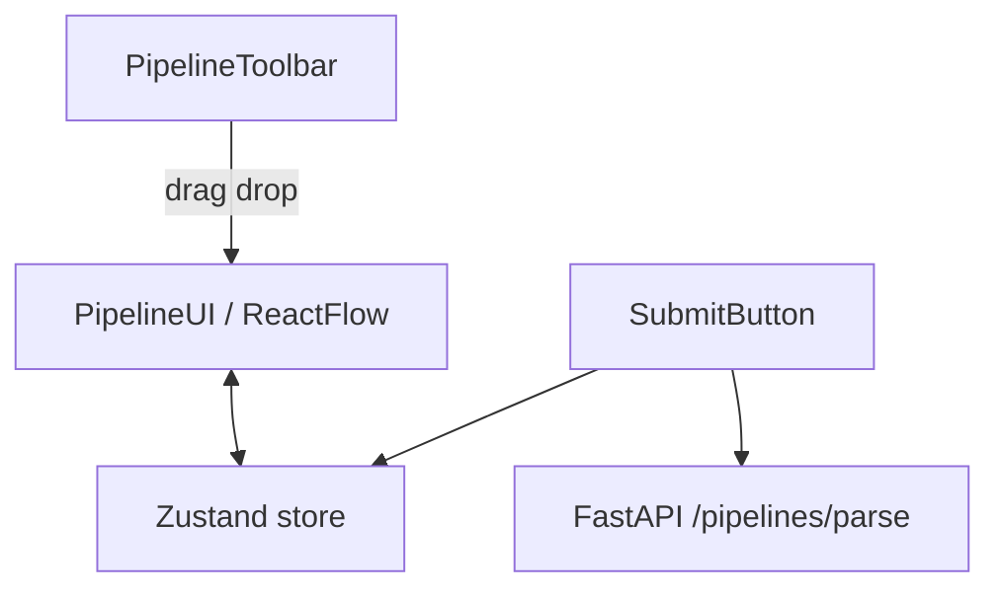

# Architecture

## Overview

Monorepo with a React pipeline editor (frontend) and a FastAPI validation service (backend). State lives in Zustand; React Flow renders the graph.

## Frontend layers

### State (`store.js`)

- `nodes`, `edges` — graph controlled by React Flow
- `nodeIDs` — per-type counters for unique IDs
- `updateNodeField` — syncs node `data` from components
- `getNodeID(type)` — returns e.g. `llm-1`

### Node abstraction (`nodes/`)

- **BaseNode** — shared shell: title, fields, static handles
- **nodeRegistry** — maps React Flow `type` → component + default data
- **nodeConfigs** — declarative field/handle definitions per node type
- **TextNode** — extends behavior: auto-resize, `{{var}}` regex handles

New nodes = add config + registry entry + toolbar item (no copy-paste).

### Text node variables

Regex: `/\{\{\s*([a-zA-Z_$][\w$]*)\s*\}\}/g`

Unique identifiers → target handles on the left (`id-var-{name}`).

### Submit flow

1. Serialize `{ nodes, edges }` to JSON
2. `POST /pipelines/parse` with `FormData` field `pipeline`
3. Show modal with `num_nodes`, `num_edges`, `is_dag`

## Backend

### `POST /pipelines/parse`

- Accepts `pipeline` form field (JSON string)
- Counts nodes and edges
- **DAG check:** Kahn's algorithm (topological sort). If processed count < node count → cycle exists.

### CORS

`ALLOWED_ORIGINS` env (comma-separated) for Vercel + localhost.

## Deployment split

| Service | Host | Role |
|---------|------|------|
| React static | Vercel | UI |
| FastAPI | Render | Graph validation API |

Frontend calls API via `REACT_APP_API_URL`.
